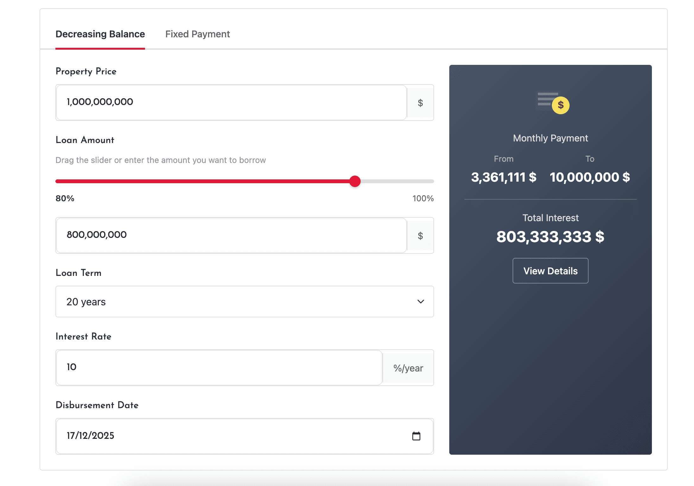
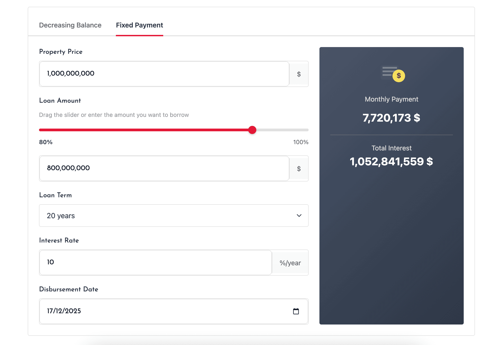
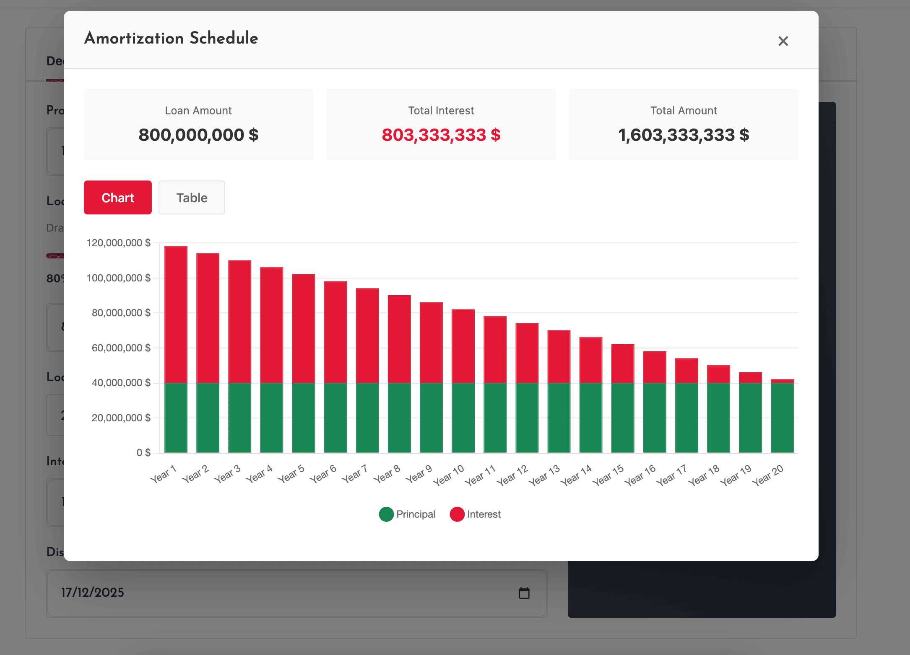
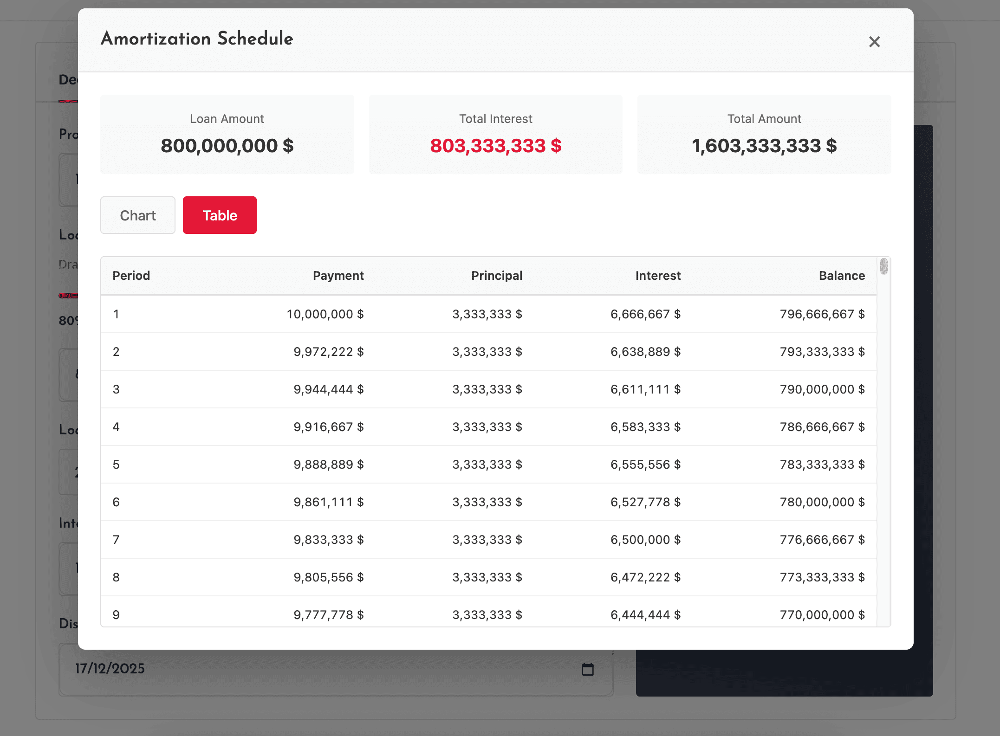

# FOB Mortgage Calculator

This is a plugin for Botble CMS that adds a mortgage payment calculator to your website. It works with all Botble Real Estate scripts.

## Requirements

- Botble Core 7.5.0 or higher
- PHP 8.2 or higher

## Installation

1. Download the plugin
2. Extract to `platform/plugins/fob-mortgage-calculator`
3. Go to Admin -> Plugins and activate "FOB Mortgage Calculator"
4. Configure default values in Settings -> Mortgage Calculator

## Features

- Shortcode `[mortgage_calculator]` for page builder
- Sidebar widget for property pages
- Real-time calculations (no server requests)
- Customizable default values
- Support for extra costs (tax, insurance, HOA)
- Multiple display styles (default, compact)
- Custom SASS styling (no Bootstrap dependency)
- RTL and accessibility support
- Multi-language support

## Screenshots

### Decreasing Balance Mode


### Fixed Payment Mode


### Amortization Schedule - Chart View


### Amortization Schedule - Table View


## Usage

### Shortcode

Add the mortgage calculator to any page using the shortcode:

```
[mortgage_calculator style="default" default_rate="6.5" default_term="30"]
```

### Widget

1. Go to Appearance -> Widgets
2. Drag "Mortgage Calculator" to a sidebar
3. Configure widget settings

### Settings

Configure default values at Settings -> Mortgage Calculator:

- Default interest rate
- Default loan term
- Down payment type (percentage or fixed amount)
- Term options
- Currency symbol
- Show/hide extra costs

## Contributing

Please see [CONTRIBUTING](CONTRIBUTING.md) for details.

## Security

If you discover any security related issues, please email contact@friendsofbotble.com instead of using the issue tracker.

## Credits

- [Friends Of Botble](https://github.com/FriendsOfBotble)
- [All Contributors](../../contributors)

## License

The MIT License (MIT). Please see [License File](LICENSE) for more information.
